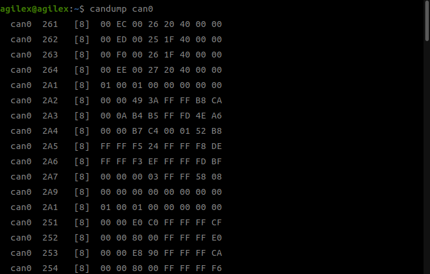

# Nero First-Time User Guide (CAN)

> Step-by-step guide for first-time Nero robotic arm users using CAN communication.

## Table of Contents

- [Switch to 中文](#nero-首次使用指南can)
- [1. Environment Requirements](#1-environment-requirements)
- [2. Hardware Connection and Software Flow](#2-hardware-connection-and-software-flow)
- [3. Common Troubleshooting](#3-common-troubleshooting)
- [Safety Notes](#safety-notes)

## 1. Environment Requirements

- Ubuntu 20.04 / 22.04 (recommended) / 24.04
- Python >= 3.6
- Install `pyAgxArm` via pip
- Install `can-utils` on Ubuntu

## 2. Hardware Connection and Software Flow

**Preparation:**

- Nero robotic arm
- Nero power adapter
- CAN-to-USB module (with Type-C to USB-A cable)
- Ubuntu PC (with USB-A port)

> Pick the block for your firmware (`get_firmware()` or web UI). **≥ 1.12 (`NeroFW.V112` / `NeroFW.V120`):** CAN feedback starts at power-up — no web CAN-push toggle or `set_normal_mode()`.

### Firmware ≥ 1.20 (`NeroFW.V120`)

Same connect flow as V112; use `NeroFW.V120` when firmware is **1.20 or later**.

### Firmware 1.12 (`NeroFW.V112`)

1. Connect USB-to-CAN to Nero CAN (H/L), activate `can0` on PC (see [can_user](../can_user.md#can-module-manual)).
2. Power on the arm; wait for green indicator.
3. Connect and enable in code (no `set_normal_mode()`):

```python
import time
from pyAgxArm import create_agx_arm_config, AgxArmFactory, ArmModel, NeroFW

robot_cfg = create_agx_arm_config(
    robot=ArmModel.NERO, firmeware_version=NeroFW.V112, channel="can0")
robot = AgxArmFactory.create_arm(robot_cfg)
robot.connect()

while not robot.enable():
    time.sleep(0.01)
```

4. Run `candump can0` — data should appear after power-on.

### Firmware ≤ 1.11 (`NeroFW.DEFAULT` / `NeroFW.V111`)

#### Method 1

1. Connect USB-to-CAN to Nero CAN (H/L), activate `can0` on PC.
2. Power on; wait for green indicator; enable CAN push in Nero web UI.
3. Run `candump can0`.

#### Method 2

1. Connect USB-to-CAN and power on as above.
2. Call `set_normal_mode()` while enabling (opens CAN push on controller):

```python
import time
from pyAgxArm import create_agx_arm_config, AgxArmFactory, ArmModel, NeroFW

robot_cfg = create_agx_arm_config(
    robot=ArmModel.NERO, firmeware_version=NeroFW.DEFAULT, channel="can0")
robot = AgxArmFactory.create_arm(robot_cfg)
robot.connect()

while not robot.enable():
    robot.set_normal_mode()
    time.sleep(0.01)
```

3. Run `candump can0`.

### Summary

| Firmware | Get CAN data on bus |
|---|---|
| ≥ 1.20 | Power on → `connect()` → `enable()` (`NeroFW.V120`) |
| 1.12 | Power on → `connect()` → `enable()` (`NeroFW.V112`) |
| ≤ 1.11 | Web UI CAN push **or** `set_normal_mode()` while enabling |

Example `candump can0` stream:



Read joint angles after connect (V112: no `set_normal_mode()`):

```python
import time
from pyAgxArm import create_agx_arm_config, AgxArmFactory, ArmModel, NeroFW

robot_cfg = create_agx_arm_config(
    robot=ArmModel.NERO, firmeware_version=NeroFW.V112, channel="can0")
robot = AgxArmFactory.create_arm(robot_cfg)
robot.connect()

while not robot.enable():
    time.sleep(0.01)

while True:
    print(robot.get_joint_angles())
    time.sleep(0.01)
```

## 3. Common Troubleshooting

**No data from `candump`:**
- Wrong `firmeware_version` for your arm firmware
- Firmware ≤ 1.11: CAN push not enabled (web UI or `set_normal_mode()`)
- Wrong bitrate when activating CAN
- H/L wires reversed
- CAN wire not properly stripped (no copper contact)

**`connect` failed:**
- `can0` does not exist

**Arm indicator is not green:**
- Arm initialization not finished
- Check power supply and 24V adapter output

## Safety Notes

> - Ensure there are no obstacles around the arm during first power-on.
> - Do not send motion commands when arm state is unknown.

---

# Nero 首次使用指南（CAN）

> Nero 机械臂首次使用 CAN 通信的分步指南。

## 目录

- [切换到 English](#nero-first-time-user-guide-can)
- [一、环境要求](#一环境要求)
- [二、硬件连接以及软件执行流程](#二硬件连接以及软件执行流程)
- [三、常见错误排查](#三常见错误排查)

## 一、环境要求

- Ubuntu 20.04 / 22.04（推荐）/ 24.04
- Python >= 3.6
- pip 安装 pyAgxArm
- Ubuntu 安装 can-utils

## 二、硬件连接以及软件执行流程

**准备：**

- Nero 机械臂
- Nero 机械臂适配器
- CAN 转 USB 模块（带 Type-C 转 USB-A 线材）
- Ubuntu 系统 PC 一台（需要有 USB-A 接口）

> 按固件选择下列流程（`get_firmware()` 或上位机查看）。**≥ 1.12（`NeroFW.V112` / `NeroFW.V120`）：** 上电即 CAN 推送，无需网页开关或 `set_normal_mode()`。

### 固件 ≥ 1.20（`NeroFW.V120`）

连接流程与 V112 相同；固件 **≥ 1.20** 时使用 `NeroFW.V120`。

### 固件 1.12（`NeroFW.V112`）

1. USB 转 CAN 接 H/L，PC 激活 `can0`（见 [can_user](../can_user.md#can-模块使用手册)）。
2. 机械臂上电，待绿灯。
3. 代码连接并使能（无需 `set_normal_mode()`）：

```python
import time
from pyAgxArm import create_agx_arm_config, AgxArmFactory, ArmModel, NeroFW

robot_cfg = create_agx_arm_config(
    robot=ArmModel.NERO, firmeware_version=NeroFW.V112, channel="can0")
robot = AgxArmFactory.create_arm(robot_cfg)
robot.connect()

while not robot.enable():
    time.sleep(0.01)
```

4. 执行 `candump can0`，上电后应有数据。

### 固件 ≤ 1.11（`NeroFW.DEFAULT` / `NeroFW.V111`）

#### 方法一

1. 接 CAN、上电、绿灯后，网页上位机打开 CAN 推送。
2. `candump can0` 应有数据。

#### 方法二

1. 接 CAN 并上电。
2. 使能循环中调用 `set_normal_mode()`（主控打开 CAN 推送）：

```python
import time
from pyAgxArm import create_agx_arm_config, AgxArmFactory, ArmModel, NeroFW

robot_cfg = create_agx_arm_config(
    robot=ArmModel.NERO, firmeware_version=NeroFW.DEFAULT, channel="can0")
robot = AgxArmFactory.create_arm(robot_cfg)
robot.connect()

while not robot.enable():
    robot.set_normal_mode()
    time.sleep(0.01)
```

3. `candump can0` 验证。

### 总结

| 固件 | 总线上有 CAN 数据 |
|---|---|
| ≥ 1.20 | 上电 → `connect()` → `enable()`（`NeroFW.V120`） |
| 1.12 | 上电 → `connect()` → `enable()`（`NeroFW.V112`） |
| ≤ 1.11 | 网页 CAN 推送 **或** 使能时 `set_normal_mode()` |

正常 `candump can0` 数据流：


读取关节角示例（V112 无需 `set_normal_mode()`）：

```python
import time
from pyAgxArm import create_agx_arm_config, AgxArmFactory, ArmModel, NeroFW

robot_cfg = create_agx_arm_config(
    robot=ArmModel.NERO, firmeware_version=NeroFW.V112, channel="can0")
robot = AgxArmFactory.create_arm(robot_cfg)
robot.connect()

while not robot.enable():
    time.sleep(0.01)

while True:
    print(robot.get_joint_angles())
    time.sleep(0.01)
```

## 三、常见错误排查

**candump 没有数据：**
- `firmeware_version` 与真实固件不符
- 固件 ≤ 1.11：未开 CAN 推送（网页或 `set_normal_mode()`）
- 激活 CAN 时 bitrate 错误
- H/L 接反
- CAN 线未露出铜线

**connect 失败：**
- can0 不存在

**机械臂灯非绿色：**
- 机械臂未初始化完成
- 检查电源是否正常，适配器 24V 输出是否有电压

> **安全警告：**
>
> - 首次上电请确保机械臂周围无障碍物
> - 不要在未知状态下发送运动指令
